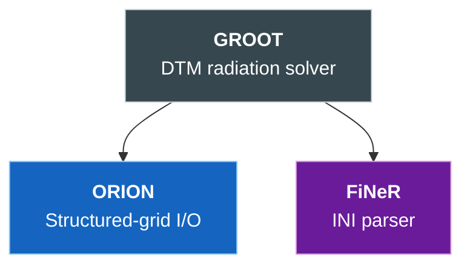
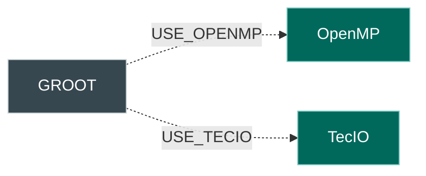
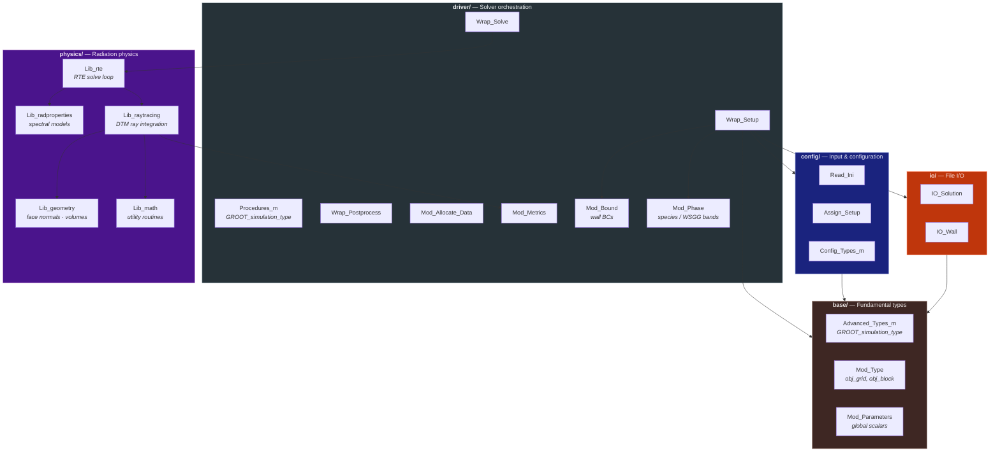
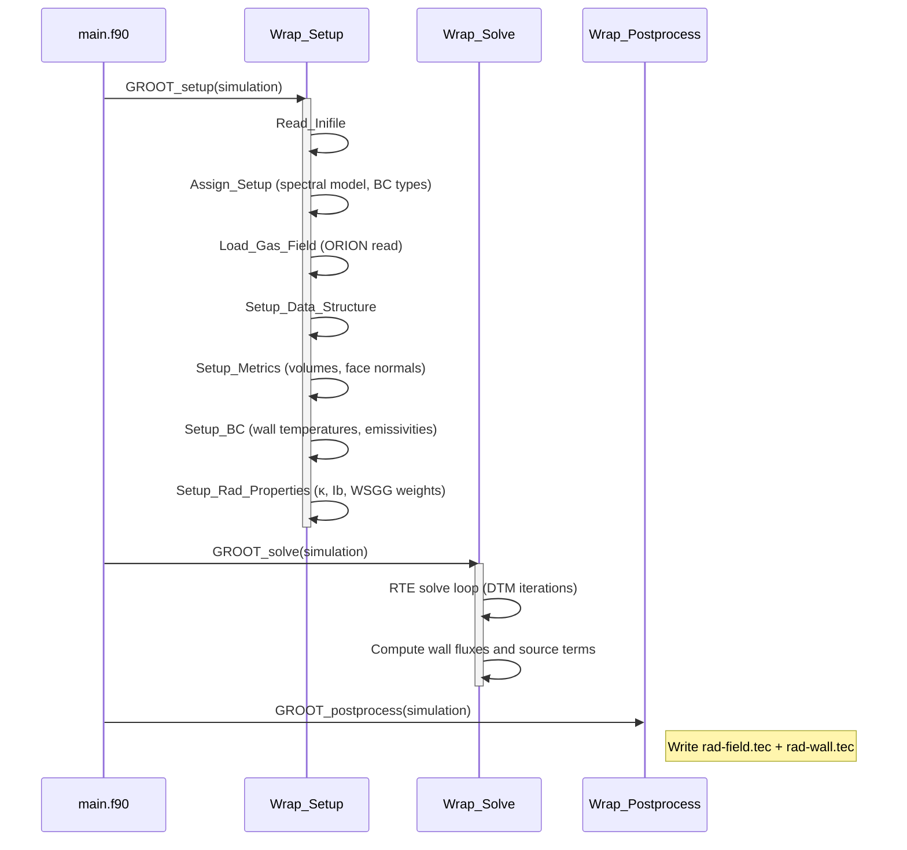
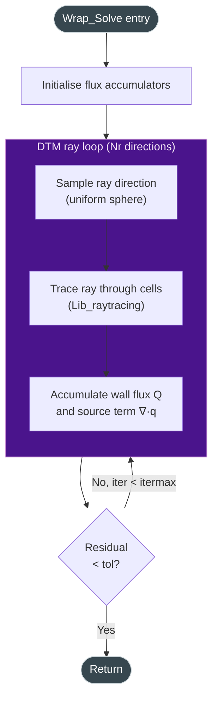
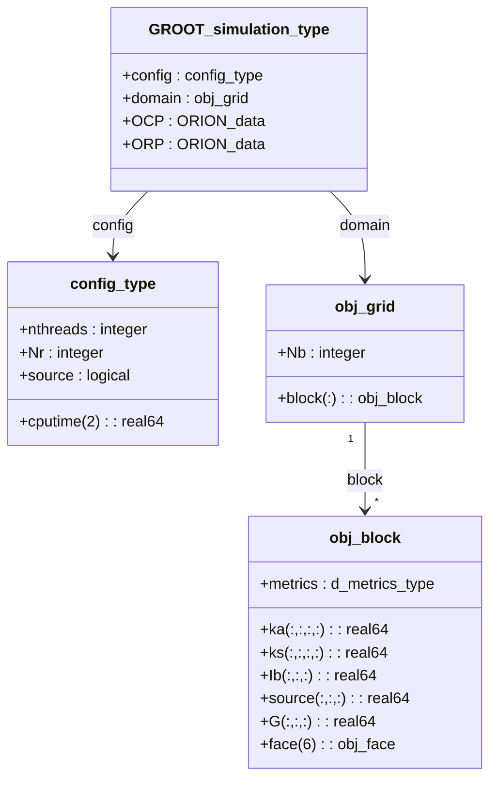
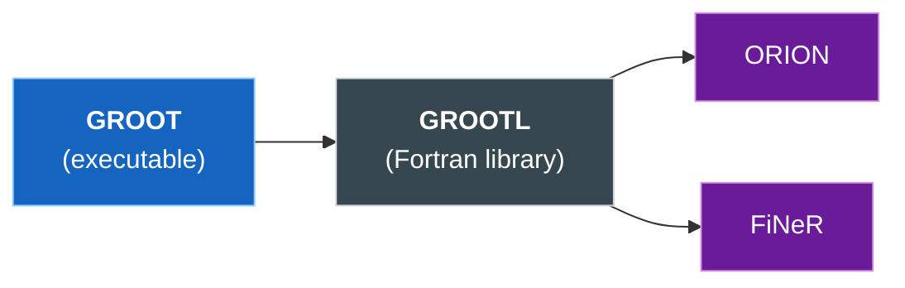

# Code Structure

This page documents the repository layout, the internal architecture
of the GROOT library, and the solver execution pipeline.  All diagrams
use [Mermaid](https://mermaid.js.org/) and render directly in the
documentation.

---

## Repository Layout

```
GROOT/
├── CMakeLists.txt          # Top-level CMake build
├── CMakePresets.json        # Developer presets (compilers, paths)
├── install.sh               # Build / compile / update helper
├── mkdocs.yml               # Documentation site configuration
│
├── src/
│   ├── app/                 # Executables
│   │   └── main.f90         # GROOT solver entry point
│   └── lib/                 # GROOT library (GROOTL)
│       ├── base/            # Fundamental types and global parameters
│       ├── config/          # Input parsing, registry, setup assignment
│       ├── driver/          # High-level solver orchestration
│       ├── io/              # File I/O (solution, walls)
│       └── physics/         # Radiation physics
│           ├── Lib_radproperties.f90  #   Spectral models (gray, WSGG)
│           ├── lib_geometry.f90       #   Face normals and cell volumes
│           ├── lib_math.f90           #   Utility math routines
│           ├── lib_raytracing.f90     #   DTM ray tracing
│           └── lib_rte.f90            #   RTE solve loop
│
├── lib/                     # External dependencies (git submodules)
│   ├── ORION/               # Structured-grid I/O library
│   └── third_party/
│       └── FiNeR/           # INI file parser
│
├── test/                    # Validation test suite
│   ├── homcube/             #   Homogeneous cube (3-D)
│   ├── cube_periodic/       #   Cube with periodic BCs
│   ├── finite_cylinder/     #   Axisymmetric cylinder
│   ├── furnace_source/      #   Axisymmetric furnace, non-uniform T
│   ├── quadrilateral/       #   Scalene trapezoid enclosure
│   └── furnace3d/           #   3-D box furnace (Selcuk 1985)
│
├── docs/                    # MkDocs documentation source
├── cmake/                   # CMake modules (compiler flags, OpenMP, etc.)
├── bin/                     # Built executables (GROOT)
└── build/                   # Build artefacts
```

---

## Dependency Graph



Optional compile-time dependencies:



---

## Library Architecture

The GROOT library (`libGROOTL`) is organised in five layers.  Lower
layers have no knowledge of higher layers.



---

## Module Hierarchy

Each source file contains a Fortran module following a consistent
naming convention:

| Prefix | Role | Example |
|--------|------|---------|
| `Mod_*` | Module defining types, data, and procedure pointers | `Mod_Allocate_Data`, `Mod_Bound` |
| `Lib_*` | Library of pure computational routines | `Lib_rte`, `Lib_raytracing` |
| `*_m` | Fundamental type / parameter modules | `Advanced_Types_m`, `Config_Types_m` |
| `Wrap_*` | High-level driver wrappers | `Wrap_Setup`, `Wrap_Solve` |
| `IO_*` | File I/O routines | `IO_Solution` |
| `Read_*` | Input file parsing | `Read_Ini` |

All public symbols are prefixed with `GROOT_` to avoid namespace
collisions when GROOT is linked as a library.

---

## Solver Pipeline

The main program (`src/app/main.f90`) creates a `GROOT_simulation_type` object
and calls three phases: **setup**, **solve**, and **postprocess**.



### DTM Solve Loop

Each call to the RTE solver performs the Discrete Transfer Method
iteration until the wall-flux residual falls below `tol`:



---

## Data Structures

### Simulation container

The top-level type is `GROOT_simulation_type`, which wraps the
computational domain and configuration:



| Array | Shape | Content |
|-------|-------|---------|
| `ka` | `(Nx, Ny, Nz, 0:Ngg)` | Absorption coefficient per spectral band |
| `ks` | `(Nx, Ny, Nz, 0:Ngg)` | Scattering coefficient per spectral band |
| `Ib` | `(Nx, Ny, Nz)` | Blackbody intensity $\sigma T^4 / \pi$ |
| `source` | `(Nx, Ny, Nz)` | Radiative source term $\nabla \cdot \mathbf{q}_r$ |
| `G` | `(Nx, Ny, Nz)` | Irradiation (incident radiation) |

### Face data

Each of the six faces of a block stores wall quantities:

| Array | Shape | Content |
|-------|-------|---------|
| `face(f)%Q` | `(n1, n2, 0:Ngg)` | Spectral wall heat flux [W/m²] per band |
| `face(f)%Qtot` | `(n1, n2)` | Total wall heat flux [W/m²] |
| `face(f)%T` | `(n1, n2)` | Wall temperature [K] |
| `face(f)%eps` | `(n1, n2)` | Wall emissivity |
| `face(f)%bc` | `(n1, n2)` | BC type identifier |

---

## Build System

### CMake targets



| Target | Type | Description |
|--------|------|-------------|
| `GROOTL` | Static library | Core solver + all physics |
| `GROOT` | Executable | Standalone solver (`src/app/main.f90`) |

### Build workflow

```bash
# Option A: install.sh (recommended for first build)
./install.sh build --compilers=gnu

# Option B: CMake presets (for iterative development)
./install.sh compile
# or equivalently:
cmake --preset default && cmake --build build
```

Key CMake options:

| Option | Default | Effect |
|--------|:-------:|--------|
| `USE_OPENMP` | OFF | Enable OpenMP threading |
| `USE_TECIO` | OFF | Enable TecIO binary output |

### Dependency paths

| Variable | Default | Library |
|----------|---------|---------|
| `ORION_PATH` | `lib/ORION/` | ORION I/O |
| `FINER_PATH` | `lib/third_party/FiNeR/` | FiNeR INI parser |

---

## Naming Conventions

| Convention | Example | Meaning |
|------------|---------|---------|
| `GROOT_` prefix | `GROOT_Config_Types_m` | Public Fortran module |
| `obj_` prefix | `obj_dtm`, `obj_rad_model` | Global configuration singleton |
| `Lib_` prefix | `Lib_rte`, `Lib_raytracing` | Computational routine library |
| `Mod_` prefix | `Mod_Allocate_Data` | Module with types or driver logic |
| `Wrap_` prefix | `Wrap_Solve` | Driver-level wrapper |
| `_m` suffix | `Config_Types_m` | Fundamental type module |
| `_type` suffix | `GROOT_simulation_type` | Derived type |
