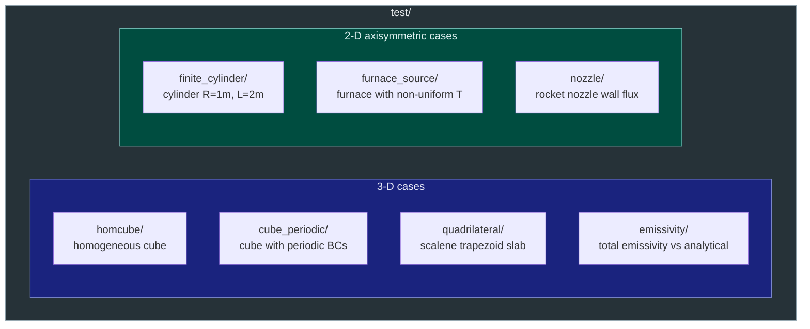
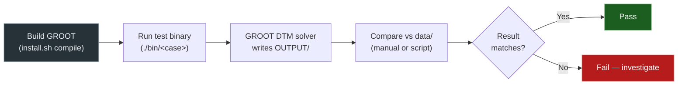

# Testing

GROOT ships with a validation test suite that exercises the solver on
canonical problems with known analytical or reference solutions.  This
page describes the test organisation, how to run tests, and how to add
new cases.

---

## Test Organisation



### Test cases summary

| Test | Geometry | Type | What is checked |
|------|----------|------|-----------------|
| **homcube** | 1 m³ cube, 30³ cells | 3-D | Wall flux and source term vs analytical solution |
| **cube_periodic** | 1 m³ cube, periodic lateral BCs | 3-D | Periodic BC handling |
| **finite_cylinder** | Cylinder R=1 m, L=2 m | 2-D axisym | Lateral wall flux and axis source vs Python reference |
| **furnace_source** | Cylinder R=0.45 m, L=5 m | 2-D axisym | Non-uniform T field; source and wall flux vs reference |
| **quadrilateral** | Scalene trapezoid ABCD | 3-D slab | Wall flux on bilinear TFI mesh |
| **emissivity** | Uniform isothermal medium | 3-D | Total emissivity vs analytical for gray, WSGG, SNBW, SNB |
| **nozzle** | Rocket nozzle wedge mesh | 2-D axisym | Wall heat flux with H₂O+CO₂ CEA profile, four spectral models |

---

## Test Case Structure

Each test case is a self-contained directory:

```
test/homcube/
├── homcube.f90        ← self-contained Fortran program
├── CMakeLists.txt     ← CMake target definition
├── data/              ← reference solutions
│   └── ref_source_k1.dat
└── OUTPUT/            ← solver output (created on run)
    ├── source_axis.dat
    └── heatflux_face1.dat
```

All test programs build the mesh and thermodynamic field entirely in
memory — no external mesh or field files are required.

| Component | Purpose |
|-----------|---------|
| `*.f90` | Fortran program: configure, build mesh, solve, write output |
| `CMakeLists.txt` | Links against `GROOTL` and `FiNeR`, sets `RUNTIME_OUTPUT_DIRECTORY` |
| `data/` | Reference solution files for post-processing comparison |
| `OUTPUT/` | Output files written by the solver (e.g. wall heat flux, source term) |

---

## Running Tests

### Build all tests

All test executables are built as part of the top-level CMake project
when `CMAKE_SOURCE_DIR == CMAKE_CURRENT_SOURCE_DIR`:

```bash
./install.sh build --compilers=gnu
# or, after the first build:
./install.sh compile
```

The executables are placed in `test/<case>/bin/<case>`.

### Run a single test

```bash
cd test/homcube
./bin/homcube
```

For OpenMP:

```bash
export OMP_NUM_THREADS=4
ulimit -s unlimited
./bin/homcube
```

### Inspect results

Each case writes plain ASCII output files to `OUTPUT/`.  Reference data
are in `data/`.  Any Python script or plotting tool can be used to
compare them:

```bash
cd test/finite_cylinder
python3 data/cylinder.py       # regenerate reference (optional)
python3 - <<'EOF'
import numpy as np, matplotlib.pyplot as plt
ref  = np.loadtxt('data/ref_qwall_k1.dat')
calc = np.loadtxt('OUTPUT/heatflux_lateral.dat')
plt.plot(ref[:,0], ref[:,1], 'k-', label='Reference')
plt.plot(calc[:,0], calc[:,1], 'r--', label='GROOT')
plt.legend(); plt.show()
EOF
```

---

## Test Workflow Diagram



---

## Adding a New Test Case

1. Create a directory under `test/` (e.g. `test/my_case/`).
2. Write a self-contained Fortran program `my_case.f90` following the
   existing test pattern:
   - Configure `obj_dtm`, `obj_rad_model`, `obj_io` directly in code.
   - Call `Assign_Setup()` then build the mesh/field with `Create_IOgas`.
   - Call `Setup_Data_Structure`, `Setup_Metrics`, `Setup_BC`,
     `Setup_Rad_*`, and `GROOT_solve`.
   - Write output to `OUTPUT/` with `open(newunit=...)`.
3. Add a `CMakeLists.txt`:
   ```cmake
   set(target my_case)
   add_executable(${target} my_case.f90)
   target_link_libraries(${target} PRIVATE GROOTL FiNeR::FiNeR)
   target_include_directories(${target} INTERFACE
       $<BUILD_INTERFACE:${CMAKE_Fortran_MODULE_DIRECTORY}>)
   set_target_properties(${target} PROPERTIES
       RUNTIME_OUTPUT_DIRECTORY ${CMAKE_SOURCE_DIR}/test/my_case/bin)
   ```
4. Add `add_subdirectory(test/my_case)` to the root `CMakeLists.txt`.
5. Place reference data in `data/` and document the expected outputs.

---

## Reference Solution Generation

Reference solutions are computed analytically (when a closed-form
solution exists) or numerically with independent codes:

| Test | Reference source |
|------|-----------------|
| `homcube` | Analytical integral over uniform isothermal cube |
| `finite_cylinder` | Python script `data/cylinder.py` (numerical integration via `scipy.integrate`) |
| `furnace_source` | Old GROOT code output |
| `emissivity` | Analytical total emissivity formula |
| `nozzle` | Legacy GROOT run (high-resolution reference) |
| `quadrilateral` | Old GROOT code (note: old code segfaulted — reference is indicative) |
