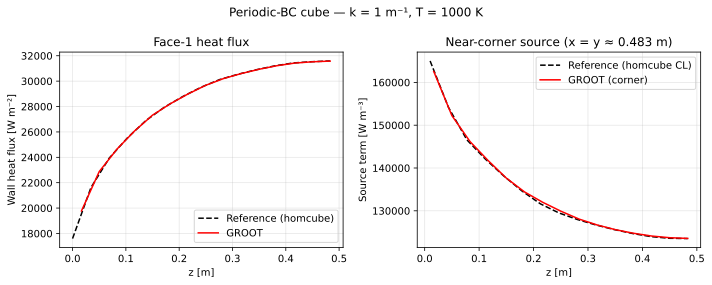

# Periodic-BC Cube

## Problem description

This test verifies the symmetry boundary condition implementation.
A half-cube of size 0.5×0.5×0.5 m³ is solved with **symmetry planes** on the
three faces at $x = 0.5$, $y = 0.5$, and $z = 0.5$, and opaque black walls on
the remaining three faces.

By the symmetry of the full 1×1×1 cube problem, the radiation field in
$[0, 0.5]^3$ must be identical to the corresponding octant of the full-cube
solution ([Homogeneous Cube](homcube.md)).

## Geometry and boundary conditions

| Face | Position | BC |
|------|----------|----|
| 1 | $x = 0$ | Black wall ($\varepsilon = 1$, $T_w = 0$ K) |
| 2 | $x = 0.5$ m | Symmetry plane (`bc = 300`) |
| 3 | $y = 0$ | Black wall |
| 4 | $y = 0.5$ m | Symmetry plane |
| 5 | $z = 0$ | Black wall |
| 6 | $z = 0.5$ m | Symmetry plane |

Mesh: 15 × 15 × 15 cells — same cell spacing as the full cube (d$x$ = 1/30 m).

## Reference solution

The reference is the same data generated by `data/cube.py` for the full cube.
Since the cell spacing is identical and the domain is a direct subset, cell
$(i, j, k)$ with $i, j, k \le 15$ maps one-to-one to the full-cube solution.

Two quantities are compared:

- **Face-1 wall heat flux** $q_w(z)$ — directly comparable to the homcube reference
- **Near-corner source** at $(x \approx 0.483\ \text{m},\ y \approx 0.483\ \text{m})$ — by symmetry this equals the centerline source of the full cube

!!! note
    The corner position $(x = y \approx 0.483\ \text{m})$ is half a cell away from the
    symmetry plane at 0.5 m, so residual angular-quadrature asymmetry may
    produce differences up to ~10 %.

## Numerical setup

| Parameter | Value |
|-----------|-------|
| Mesh | 15 × 15 × 15 |
| Rays $N_r$ | 256 |
| Spectral model | Gray (const κ) |
| Wall emissivity | 1.0 (black) |

## Running the test

```bash
cd test/cube_periodic
./bin/cube_periodic_test
python verify.py --k 1.0 --plot
```

## Acceptance criteria

| Quantity | Threshold |
|----------|-----------|
| Face-1 heat flux | 10 % |
| Near-corner source | 10 % |

## Results

<figure markdown>
  
  <figcaption>Periodic-BC cube — κ = 1 m⁻¹.  Left: face-1 heat flux vs full-cube reference.  Right: near-corner source vs centreline reference.</figcaption>
</figure>

## Output files

| File | Description |
|------|-------------|
| `OUTPUT/heatflux_face1.dat` | $q_w$ vs $z$ at face 1 |
| `OUTPUT/source_corner.dat` | $\nabla\cdot\mathbf{q}_r$ vs $z$ near symmetry corner |
| `OUTPUT/cube_periodic_k<k>.svg` | Comparison plot |
