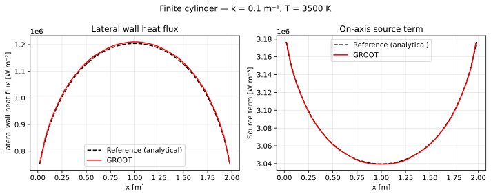
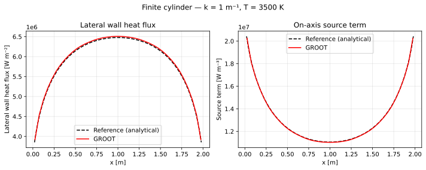
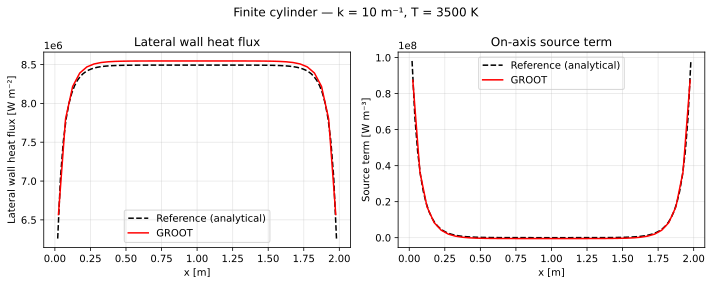

# Finite Cylinder

## Problem description

An axisymmetric finite cylinder (radius $R = 1$ m, full length $L = 2$ m)
is filled with a grey gas at uniform temperature $T = 3500$ K.  All surfaces
are black and cold ($T_w = 0$ K).

The axisymmetric geometry is represented in GROOT as a thin wedge:
$\delta\theta = 0.01$ rad, $N_k = 1$ cell in the azimuthal direction.

## Geometry and boundary conditions

| Face | Surface | BC |
|------|---------|-----|
| 1 | Left endcap ($x = 0$) | Black wall |
| 2 | Right endcap ($x = 2$ m) | Black wall |
| 3 | Axis ($r = 0$) | Specular (`bc = 300`) |
| 4 | Lateral wall ($r = R$) | Black wall |
| 5, 6 | Azimuthal slab faces | Periodic (`bc = 200`) |

Mesh: $N_i \times N_j \times 1$ cells (axial × radial × azimuthal).

## Reference solution

The reference was generated by `data/cylinder.py` using analytical
double-quadrature integration (scipy `dblquad`) for the exact radiative
intensity field in a grey cylinder.  Three absorption coefficients are
provided:

| $\kappa$ [m⁻¹] | $\kappa R$ |
|----------------|-----------|
| 0.1 | 0.1 |
| 1.0 | 1.0 |
| 10  | 10  |

Two quantities are tabulated as a function of axial position $x$:

- **Lateral wall heat flux** $q_w(x)$ at $r = R$ [W m⁻²]
- **On-axis source term** $\nabla\cdot\mathbf{q}_r(x)$ at $r = 0$ [W m⁻³]

## Numerical setup

| Parameter | Value |
|-----------|-------|
| Mesh | $N_i \times N_j \times 1$ (wedge) |
| Wedge angle $\delta\theta$ | 0.01 rad |
| Rays $N_r$ | 256 |
| Spectral model | Gray (const κ) |
| Wall emissivity | 1.0 (black) |

## Running the test

```bash
cd test/finite_cylinder
./bin/cylinder_test          # runs with k_user = 1.0 by default
python verify.py --k 1.0 --plot
```

## Acceptance criteria

| Quantity | Threshold |
|----------|-----------|
| Lateral wall heat flux | 5 % |
| On-axis source term | 5 % |

## Results

=== "κ = 0.1 m⁻¹"
    <figure markdown>
      
      <figcaption>Finite cylinder — κ = 0.1 m⁻¹ (optically thin).  Left: lateral wall heat flux.  Right: on-axis source term.</figcaption>
    </figure>

=== "κ = 1 m⁻¹"
    <figure markdown>
      
      <figcaption>Finite cylinder — κ = 1 m⁻¹.</figcaption>
    </figure>

=== "κ = 10 m⁻¹"
    <figure markdown>
      
      <figcaption>Finite cylinder — κ = 10 m⁻¹ (optically thick).</figcaption>
    </figure>

## Output files

| File | Description |
|------|-------------|
| `OUTPUT/heatflux_lateral_k<k>.dat` | $q_w$ vs $x$ on lateral wall |
| `OUTPUT/source_axis_k<k>.dat` | $\nabla\cdot\mathbf{q}_r$ vs $x$ on axis |
| `OUTPUT/finite_cylinder_k<k>.svg` | Comparison plot |
