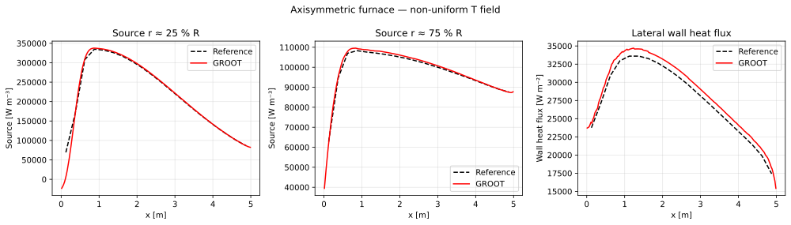

# Axisymmetric Furnace

## Problem description

An axisymmetric furnace (radius $R = 0.45$ m, length $L = 5$ m) contains
a gas with a **non-uniform temperature field** representative of a turbulent
flame.  The temperature profile $T(x, r)$ is given by a polynomial fit
(peak $T_\text{ref} \approx 1563$ K near the flame region).

This test validates GROOT for realistic heat-transfer conditions where the
source term changes sign — net cooling near the cold walls and net heating
in the flame core.

## Geometry and boundary conditions

| Face | Surface | BC | $T_w$ [K] |
|------|---------|-----|-----------|
| 1 | Left endcap ($x = 0$) | Black wall | 820.11 |
| 2 | Right endcap ($x = L$) | Black wall | 615.19 |
| 3 | Axis ($r = 0$) | Specular | — |
| 4 | Lateral wall ($r = R$) | Black wall | 349.49 |
| 5, 6 | Azimuthal slab faces | Periodic | — |

Modelled as a thin wedge ($\delta\theta = 0.01$ rad, $N_k = 1$).

## Reference solution

The reference data in `data/` is taken from Selçuk, N., “Exact Solutions for Radiative Heat Transfer in Box-Shaped
Furnaces,” ASME Journal of Heat Transfer, Vol. 107, No. 3, 1985, pp. 648–655.


Three quantities are compared as functions of axial position $x$:

- **Source term at $r \approx 25\%\ R$** — near flame core
- **Source term at $r \approx 75\%\ R$** — near lateral wall
- **Lateral wall heat flux** $q_w(x)$ at $r = R$

## Numerical setup

| Parameter | Value |
|-----------|-------|
| Mesh | $N_i \times N_j \times 1$ (wedge) |
| Wedge angle $\delta\theta$ | 0.01 rad |
| Rays $N_r$ | 256 |
| Spectral model | Gray (const κ) |
| Wall emissivity | 1.0 (black) |

## Running the test

```bash
cd test/furnace_source
./bin/furnace_test
python verify.py --plot
```


## Results

<figure markdown>
  
  <figcaption>Axisymmetric furnace.  From left: source at r ≈ 25 % R, source at r ≈ 75 % R, lateral wall heat flux.  Dashed: legacy-GROOT reference.</figcaption>
</figure>

## Output files

| File | Description |
|------|-------------|
| `OUTPUT/source_j25.dat` | $\nabla\cdot\mathbf{q}_r$ vs $x$ at $r \approx 25\%R$ |
| `OUTPUT/source_j75.dat` | $\nabla\cdot\mathbf{q}_r$ vs $x$ at $r \approx 75\%R$ |
| `OUTPUT/heatflux_lat.dat` | $q_w$ vs $x$ on lateral wall |
| `OUTPUT/furnace_source.svg` | Comparison plot |
