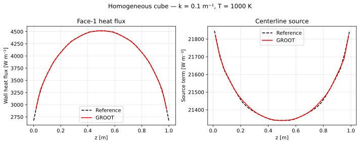
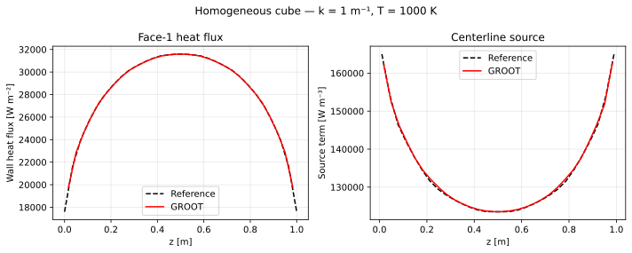
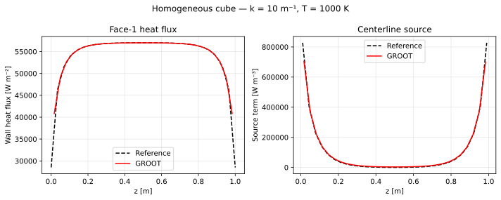

# Homogeneous Cube

## Problem description

A 1×1×1 m³ cube is filled with a grey, non-scattering gas at uniform
temperature $T = 1000$ K and uniform absorption coefficient $\kappa$.
All six walls are black ($\varepsilon = 1$) and cold ($T_w = 0$ K).

The test exercises the core DTM loop for three optical thicknesses:

| Case | $\kappa$ [m⁻¹] | $\kappa L$ |
|------|----------------|-----------|
| Optically thin | 0.1 | 0.1 |
| Intermediate   | 1.0 | 1.0 |
| Optically thick | 10 | 10  |

## Geometry and boundary conditions

```
          z
          │  T_w = 0, ε = 1 (all faces)
          │
    ┌─────┼─────┐
    │     │     │  T_gas = 1000 K
    │     └─────┼──── y       κ = κ_user
    │           │
    └───────────┘
          1 m
```

Mesh: 30 × 30 × 30 uniform cells.  No external mesh file — geometry and
field are built in memory by the test program.

## Reference solution

The reference was generated by `data/cube.py` using the same angular
quadrature as GROOT (Nr = 256 rays, identical hemisphere and full-sphere
angle sets).  Two quantities are tabulated along the z-axis:

- **Face-1 wall heat flux** $q_w(z)$ at $x = 0$, $y = L/2$ [W m⁻²]
- **Centerline source term** $\nabla \cdot \mathbf{q}_r(z)$ at $x = y = L/2$ [W m⁻³]

## Numerical setup

| Parameter | Value |
|-----------|-------|
| Mesh | 30 × 30 × 30 |
| Rays $N_r$ | 256 |
| Spectral model | Gray (const κ) |
| Wall emissivity | 1.0 (black) |
| Iterations | 1 (steady, no wall emission) |

## Running the test

The test is pre-configured in the repository — no `input.ini` is needed.

```bash
cd test/homcube
./bin/homcube
python verify.py --plot
```

## Acceptance criteria

Maximum relative error against the reference, evaluated at all output
points after linear interpolation:

| Quantity | Threshold |
|----------|-----------|
| Face-1 heat flux | 5 % |
| Centerline source | 5 % |

## Results

=== "κ = 0.1 m⁻¹"
    <figure markdown>
      
      <figcaption>Homogeneous cube — κ = 0.1 m⁻¹ (optically thin).  Left: face-1 heat flux.  Right: centreline source term.</figcaption>
    </figure>

=== "κ = 1 m⁻¹"
    <figure markdown>
      
      <figcaption>Homogeneous cube — κ = 1 m⁻¹ (intermediate optical thickness).</figcaption>
    </figure>

=== "κ = 10 m⁻¹"
    <figure markdown>
      
      <figcaption>Homogeneous cube — κ = 10 m⁻¹ (optically thick).</figcaption>
    </figure>

## Directory layout

```
test/homcube/
├── homcube.f90        ← self-contained test program (no input.ini needed)
├── CMakeLists.txt     ← build configuration
├── data/              ← reference solutions for comparison
│   ├── ref_source*
│   └── ref_heatflux*
└── OUTPUT/            ← solver output (created on run)
    ├── source_centerline*
    └── heatflux_face1*
```
