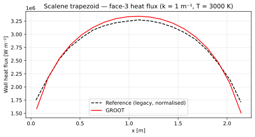

# Scalene Trapezoid

## Problem description

A non-orthogonal quadrilateral enclosure (scalene trapezoid ABCD) is extruded
as a thin slab of thickness $L_z = 0.01$ m.  The domain exercises GROOT's
support for bilinear (non-Cartesian) structured meshes and non-axis-aligned
face normals.

Vertex coordinates (counter-clockwise):

| Vertex | $x$ [m] | $y$ [m] |
|--------|---------|---------|
| A | 0.0 | 0.0 |
| B | 2.2 | 0.0 |
| C | 1.5 | 1.2 |
| D | 0.5 | 1.0 |

The interior is filled with a grey gas at uniform $T = 3000$ K.


The reference data for this test is taken from Chai, J., Parthasarathy, G., Lee, H. S., and Patankar, S. V., “Finite volume radiative heat transfer procedure for irregular geometries,” Journal
of Thermophysics and Heat Transfer, Vol. 9, No. 3, 1995, pp. 410–415.

## Geometry and boundary conditions

| Face | Surface | BC |
|------|---------|-----|
| 1 | Left wall (AD) | Black wall ($T_w = 0$) |
| 2 | Right wall (BC) | Black wall |
| 3 | Bottom wall (AB) | Black wall |
| 4 | Top wall (CD) | Black wall |
| 5, 6 | Slab faces ($z = 0$, $z = L_z$) | Specular (`bc = 300`) |

Mesh: $N_i \times N_j \times 1$.

## Reference solution

The reference files `data/ref_k{k}.dat` store the bottom-wall (face 3) heat
flux normalised by $\sigma T^4$:

$$
\tilde{q}_w = \frac{q_w}{\sigma T^4}
$$

`verify.py` denormalises the reference by $\sigma T^4 = 4.59 \times 10^6\ \text{W m}^{-2}$
before comparing with GROOT's output in physical units.

## Numerical setup

| Parameter | Value |
|-----------|-------|
| Mesh | $N_i \times N_j \times 1$ |
| Rays $N_r$ | 256 |
| Spectral model | Gray (const κ) |
| Wall emissivity | 1.0 (black) |

## Running the test

```bash
cd test/quadrilateral
./bin/quadrilateral_test     # runs with k_user = 1.0 by default
python verify.py --k 1.0 --plot
```


## Results

<figure markdown>
  
  <figcaption>Scalene trapezoid — κ = 1 m⁻¹.  Face-3 (bottom) wall heat flux vs axial position.  Dashed: legacy reference (normalised by σT⁴ and denormalised for comparison).</figcaption>
</figure>

## Output files

| File | Description |
|------|-------------|
| `OUTPUT/heatflux_face3_k<k>.dat` | $q_w$ vs $x$ on bottom wall (face 3) |
| `OUTPUT/quadrilateral_k<k>.svg` | Comparison plot |
